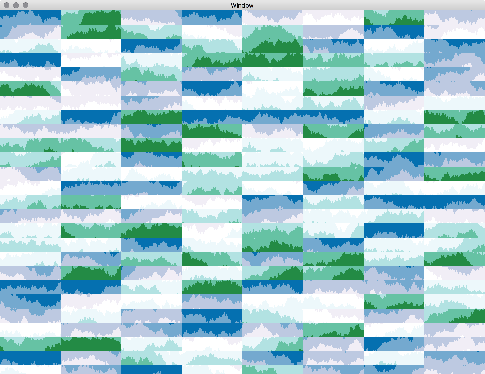

# Metal Metrics

Draw as many horizon charts as you want with the power of a Macintosh (accelerated by [Metal](https://developer.apple.com/metal/)).

## Overview

Simulated data source (one floating number generated per tick), one data source per chart, using colours from [Color Brewer](http://colorbrewer2.org) and in general implementing the Horizon Chart inspired by [Cubism](https://github.com/square/cubism).

A few non-Metal approaches were also tried which clearly explains why, if your computer is connected to mains power, a Metal-driven solution is clearly the most efficient:

* `DrawRectTimeSeriesView` — All chart instances share a single `NSTimer` which ticks six times per second. Chart refreshed in `-[NSView drawRect:]`, entire view redrawn since you are not to manipulate the bitmap context backing up NSView.

* `DisplayLinkTimeSeriesView` — All chart instances share a single `CVDisplayLinkRef` which ticks once per frame. Elegant frame dropping implemented via Grand Central Dispatch, using Dispatch Groups. On each tick, backing image is manipulated (shifted one point to the left) with vImage in Accelerate and a new data point (in reality, a new slice) plotted with CGImage.

* `DoubleLayerTimeSeriesView` — Incomplete implementation where 2 instances of the same CALayer holding reference to the same is shifted by one point on each tick so new values can be drawn in the middle of a fixed-size bitmap without having to push/invalidate all pixels around. Did not work out so well.

Obviously they are all inferior to the Metal approach:

* `MetalTimeSeriesView` — All chart instances sahre a single `CVDisplayLinkRef` which ticks once per frame. Rendition status controlled via GCD and a stupid static boolean variable (i.e. if there is capacity, then refresh all charts on the next tick, and do not refresh anything else until everything has refreshed once. In practice, this allows your charts to run at a lower frame rate if desired without locking up other bits of your interface). All chart instances backed by Metal and share the same Metal Command Queue. Vertex Buffer held as an instance variable and all vertices recomputed on each frame. (In the future they should get shifted.) Colours applied at the same time. (In the future this could be applied in the Metal program instead.)

Also included:

* `RATilingBackgroundView` — A very simple tiling view I have written ages ago (available from GitHub too), which fills a larger NSView with many small views. This is useful when stress-testing the implementation: you can full an entire screen with many charts, and look for any kind of performance degradation or timing error.

## Pictures

